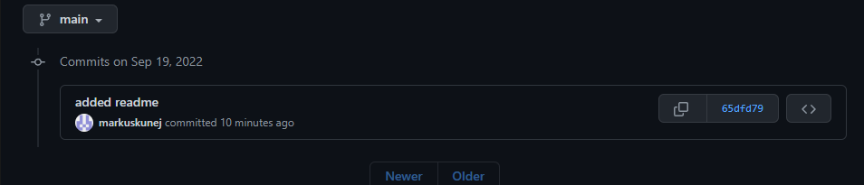
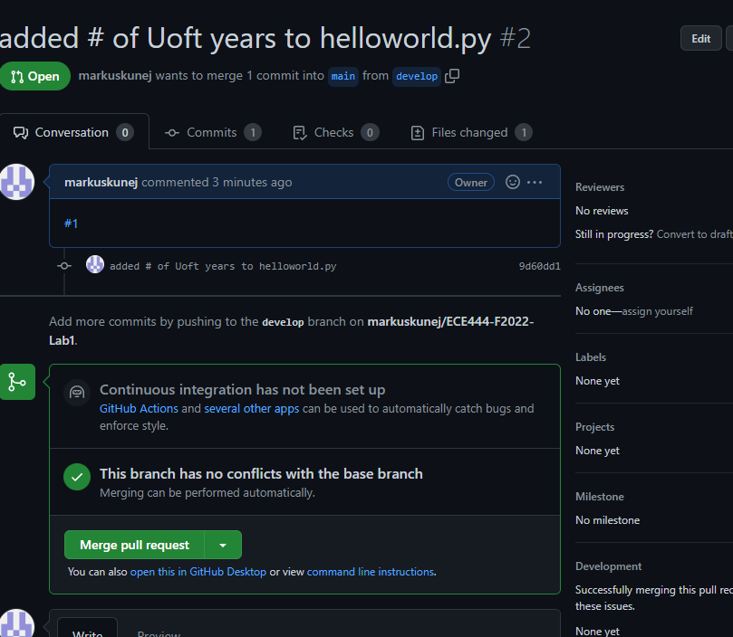
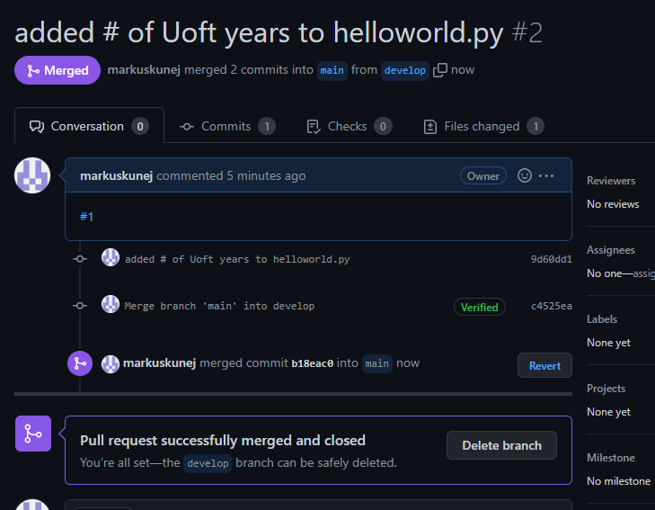
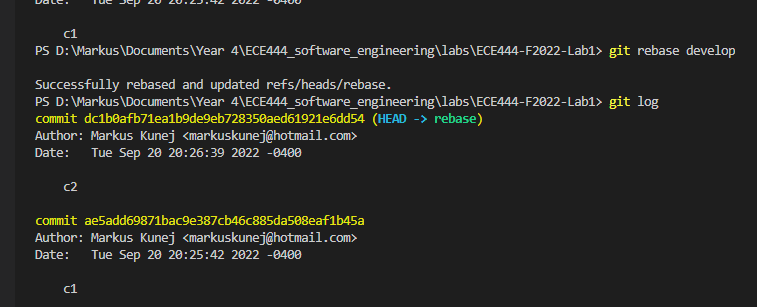
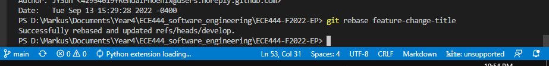
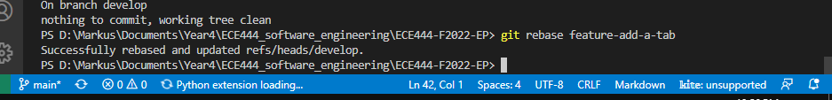

Markus Kunej

**Activity 1**

**Activity 2**

**Activity 3 (after resolving conflict)**

**Activity 3 (after merging)**

**Activity 4**

https://github.com/raineyfu/ECE444-F2022-Lab1

.png

.png)

**Activity 5**

The rebase was completed on the 'rebase' branch

**Activity 6**

https://github.com/markuskunej/ECE444-F2022-EP

**Activity 7**

Rebase Command

Title Change

.png)

**Activity 8**

Rebase

.png)